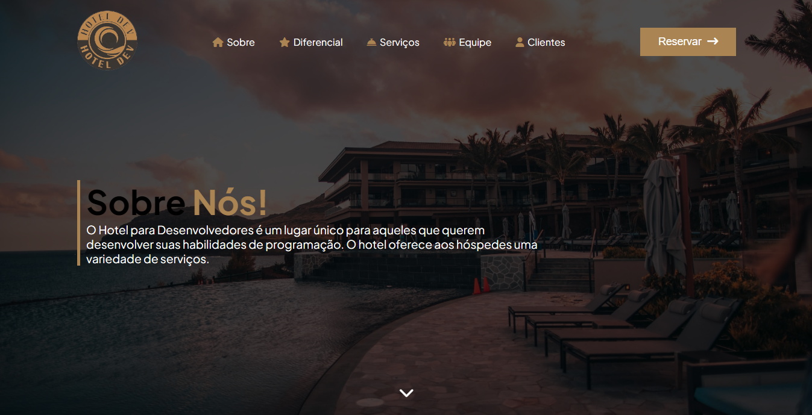

### Um lugar único para aqueles que querem desenvolver suas habilidades de programação</h3>

- 👨‍💻 Projeto individual T.EX [Hotel Dev](#)

- 🌱 Tecnologias utilizadas **HTML, CSS**

- 📄 T.EX Technology Experts [T.EX](https://texperts.com.br/)

- ⚡ Fato Engraçado **lembrei dos commits depois que terminei o projeto 😂**

### Linguagens e Ferramentas:

   

### Sobre o Desafio:

Desafio individual proposto pela T.EX no treinamento FullStack Javascript

##### Tarefas

- Criar uma versão da página [sobre](https://github.com/devguiferreira/hotel_T.EX/tree/main/public), utilizando as tecnologias [HTML CSS]
- Aplicar responsividade mínima para mobile retrato (**414px portrait**)

